# EasyVega


Julia bindings for the Vega plotting library.

Vega [(link)](https://vega.github.io/vega/) is a grammar for visualization using the JSON format. It provides all the building blocks to generate simple or complex visuals with interactive features.

> Note that Vega is a lower level language than VegaLite which is built upon it. If you want to build simple graphs quickly and with an easier learning curve, EasyVega is probably not the recommended path. You can check VegaLite [(link)](https://vega.github.io/vega-lite/) and its Julia binding [https://github.com/queryverse/VegaLite.jl](https://github.com/queryverse/VegaLite.jl) or most other Julia plotting packages.

This being said, Vega provides a variety of visuals and interactivity features that may be what you are looking for, and this Julia package brings a few syntax shortcuts that will make it easier to use.


[ 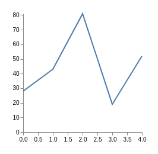 ](examples/simpleline.jl)
[ 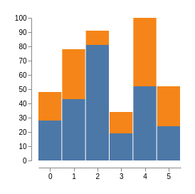 ](examples/simplebars.jl)
[ 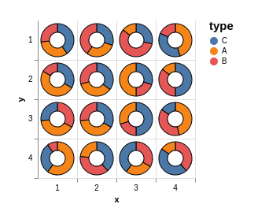 ](examples/facetpie.jl)
[ 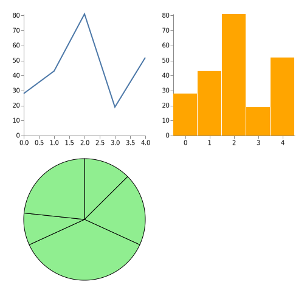 ](examples/multipleplots.jl)
[ 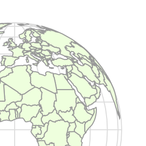 ](examples/worldmap.jl)
[ 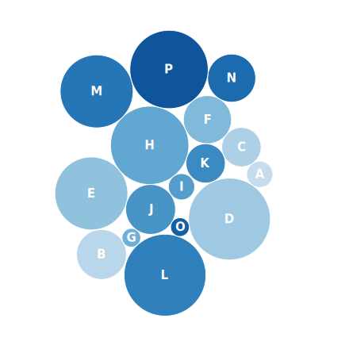 ](examples/packedbubbles.jl)
[ 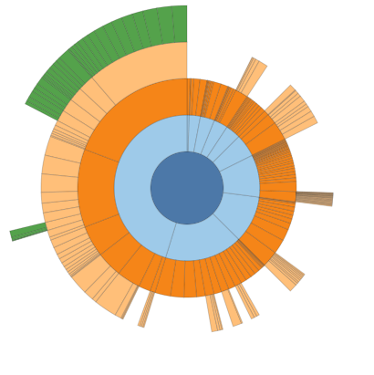 ](examples/sunburst.jl)
[ 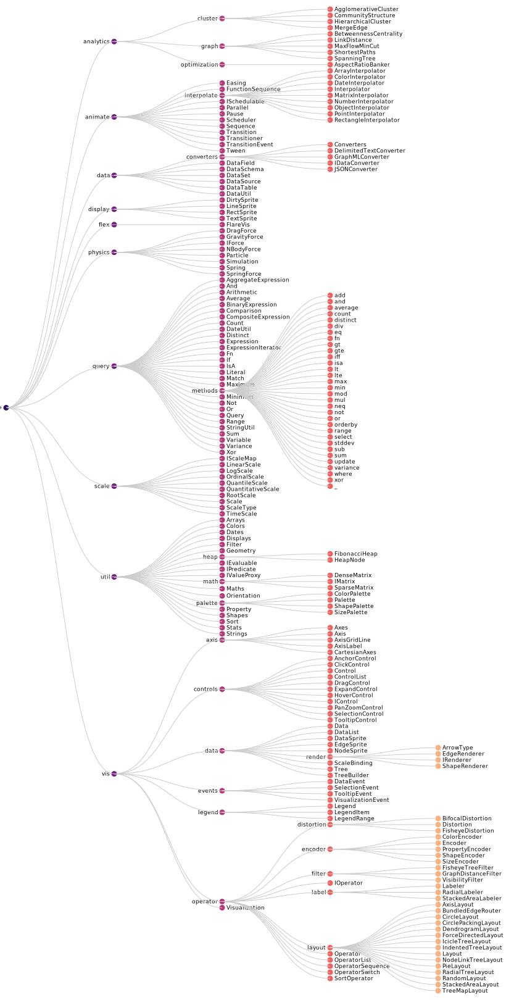 ](examples/treelayout.jl)
[ 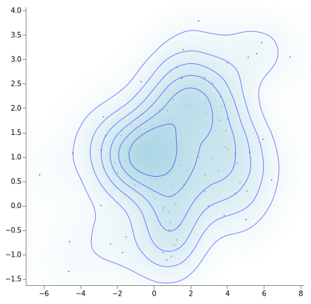 ](examples/density_and_contours.jl)
[ 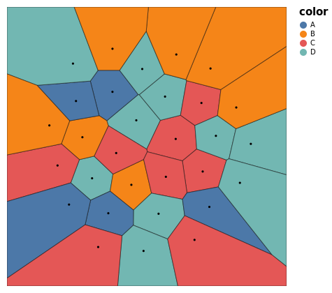 ](examples/voronoi.jl)
[ 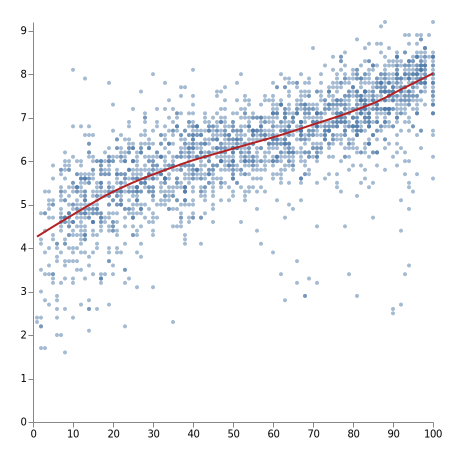 ](examples/loess.jl)


## Direct Vega specification creation

This is not the recommended way to use EasyVega but this will help understand some aspects of the EasyVega syntax. 

The function `VG()` can render a Vega plot by passing it all at once all the elements. For example to generate the minimal JSON spec below (showing a single dot) :

```JSON
{
  "width": 100,
  "height": 100,
  "marks": [
    {
      "encode": {
        "enter": {
          "x": {"value": 50},
          "y": {"value": 50},
          "size": {"value": 100}
        }
      },
      "type": "symbol"
    }
  ]
}
```

You can call the `VG()` function with each structure of the JSON translated in a named argument or a `Vector`/ `NamedTuple` :

```julia
VG(
  width= 100,
  height= 100,
  marks= [(
      encode= (
        enter= (
          x= (value= 50,),
          y= (value= 50,),
          size= (value= 100,)
        ,)
      ,),
      type= "symbol"
    )
  ]
)
```

You can also use a syntax shortcut for nested structures by appending fields with an underscore character. 
For example you can replace `x= (value= 50,)` with `x_value= 50`. This can help limit the number of nested parentheses.

By appending several levels you can rewrite the preceding example as : 

```julia
VG(
  width= 100,
  height= 100,
  marks= [(
      encode_enter_x_value= 50,
      encode_enter_y_value= 50,
      encode_enter_size_value= 100,
      type= "symbol"
    )
  ]
)
```

Currently, the allowed values (on the right hand side of the '=' sign) can be a `Number`, a `Date` / `DateTime`, an `AbstractString` / `Symbol` / `Char` (all passed as strings in the JSON) and `nothing` as the JSON equivalent for `null`.

## Define named spec elements as separate variables

The recommended way to use EasyVega is to build the plot step by step.

This syntax idea starts from the observation that Vega specs have many element types that are named : data, marks, group marks, scales,... These are defined once and often used elsewhere by referring to their name. For example a mark can be defined with a data source and one or more scales; a mark can have another mark as a source, or a scale can use a data field to define its domain. 

With EasyVega you can break down the full spec into separate definitions for each of these named elements, assign them to a variable and then use this variable in the following elements that depend on it. 
This makes the creation of the full spec look more like a small regular Julia program where variables are set one after the other and making more explicit the dependency structure.

```julia
# create a Data element with dummy numbers
dat = Data(
    values = [
        (x= 0, y= 28), 
        (x= 1, y= 43), 
        (x= 2, y= 81), 
        (x= 3, y= 19), 
        (x= 4, y= 52), 
      ]
)

# create the horizontal scale, mapping the width of the plotting area to
#  the extent of the 'x' field values in Data element 'dat'
xscale = LinearScale(range="width",  domain=dat.x)
# same for the vertical scale
yscale = LinearScale(range="height", domain=dat.y)

# create the mark, of type 'line', mapping the x of the mark to 
#  the scaled field 'x' of data and the y to the scaled 'y' field of data
lmark = LineMark(
    encode_enter=(
        x= xscale(dat.x),
        y= yscale(dat.y),
    ),
)

# wrap up everything and render with the VG() function
VG(
    width=300, height=200, background="white",
    # add axes at the bottom and left side of the graph
    axes = [ xscale(orient="bottom"), yscale(orient="left") ], 
    # specify the mark to show 
    marks= [ lmark ] 
)
```

There are several things going on in this short example : 
- the Data element creation `dat = Data(...)` allows to later refer to individual data fields with `dat.x` / `dat.y` (used in the subsequent scale and mark definitions).
- The scale creation `xscale = LinearScale(...)` provides a function `xscale(..)` indicating that the scale should be applied to the arguments, or more precisely generating an element with the scale annotation (used in the mark and axes definitions).
- The mark creation `lmark = LineMark(...)` does not need to specify the data source with a `from_data= dat`, EasyVega infers this dependance from the encodings of the 'x' and 'y' channels. 
- In the final function `VG(..)`, you only need to mention the `lmark` variable for EasyVega to pull together the scales and data definitions into the final Vega spec, they do not need to be explicitly mentionned.

Currently the named elements that can be created this way are `Data()`, `Facet()` for facetting group marks, *`type`*`Mark()`, *`type`*`Scale()`, `GroupMark()`, `Projection()` and `Signal()`.

**All the other Vega spec elements (config, axes, legends, layout, triggers, ..) are not named and should be defined explicitly in GroupMarks or the final VG()**

## Pairs for channel encodings

EasyVega has a further syntax shortcuts for describing the channel encodings in marks (including group marks).
1. the right hand side defining the channel can be simplified : 
    - for simple values : `.. = (value= x,)` can be replaced with `.. = x`
    - for data fields : `.. = (field= x,)` can be replaced with `.. = dat.x`  (with `dat` used by EasyVega to fill in the `from_data` field of the mark if it is not specified explictily)
    - for scaled data fields : `.. = (field= x, scale= myscale)` can be replaced with `.. = myscale(dat.x)`
    - for all other cases, follow the Vega syntax.
2. the mapping between channels and values / fields can be specified as a `Pair` in a positional argument of the mark function. The left hand side of the Pair can be either a single symbol which will be added to the `enter` encoding set by default, or two symbols associated by an underscore, in which case the first symbol will be interpreted as the encoding set (e.g. `update` / `hover` / `exit` / etc.) and the second one as the channel name.

For example, using both shortcuts above, this mark specification : 
```julia
SymbolMark(
    shape="circle", 
    from_data = dat,
    encode_enter=(
        xc          = (field= :x, scale= xscale), 
        yc          = (field= :y,), 
        fill        = (value= :black,), 
        size        = (value= 100, scale= sscale),
    )
    encode_update=(
        fillOpacity = (value= 0.2,), 
    )
)
```

can be replaced by the shorter equivalent : 
```julia
SymbolMark(
    shape="circle", 
    :xc                 => xscale(dat.x),
    :yc                 => dat.y, 
    :fill               => :black, 
    :size               => sscale(100),
    :update_fillOpacity => 0.2, 
)
```


## Rendering

Rendering should work in Pluto and Visual Studio Code without issues. Other front end clients need to be implemented.

## Debugging plots

Since the rendering of the JSON Vega specs occurs in a javascript runtime, EasyVega (or Vega.jl/VegaLite.jl for that matter) cannot surface easily the error messages to help debugging. This is a fundamental disadvantage compared to full Julia plotting packages.

Additionally, EasyVega will throw errors or warnings for some structural inconsistencies but will not check for the full compliance of the generated spec. 

There are however some ways to work through issues :
- The (unexported) function `trie()` will print the interpreted structure of the element provided as argument. This can help spotting typos or interpretation errors by EasyVega (you can file an issue in this case) : 

```julia-repl
julia> EasyVega.trie( LineMark( :x => 12, :x => yscale(dat.y) ) )

 encode: (enter: (x: (field: y, scale: Sc94)))
 from: (data: Da90)
 type: line
```


- The generated JSON can be copy/pasted in the online [Vega editor](https://vega.github.io/editor/#/) that provides several debugging tools (log, data viewer). 
    - In Pluto, click on "Open in Vega Editor" in the top right menu next to the plot (provided the plot appears at all)
    - In Julia run the code below and paste in the editor (and right-click + 'format document' to have a readable JSON) :

```julia
vgspec = VG(...)  # plot to debug

using InteractiveUtils
io = IOBuffer()
EasyVega.toJSON(io, EasyVega.trie(vgspec))
clipboard(String(take!(io)))
```


## Limitations / Future work
- Limited number of IDEs supported 
- No SVG / PNG file export yet
- No Vega schema compliance checking for the generated Vega JSON produced
- Vega runtime errors not reported

